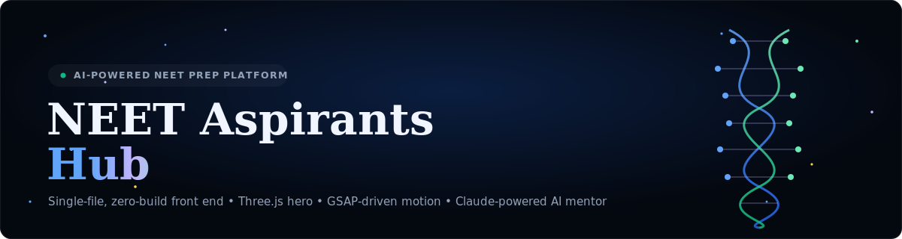
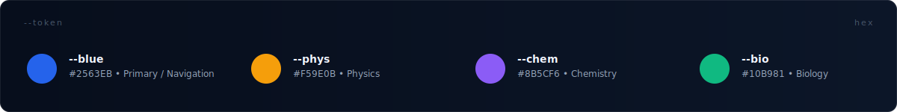

<div align="center">



<br/>


**A single-file, zero-build landing experience for India's NEET-UG aspirants** — a Three.js molecular hero, a GSAP-choreographed scroll narrative, and an AI study mentor, shipped as one portable `index.html`.

</div>

<br/>

## Table of Contents

- [Overview](#overview)
- [Design System](#design-system)
- [Architecture](#architecture)
- [Tech Stack](#tech-stack)
- [The 3D Hero Scene — A Deep Dive](#the-3d-hero-scene--a-deep-dive)
- [Motion & Interaction Layer](#motion--interaction-layer)
- [Dr. NEET — The AI Mentor](#dr-neet--the-ai-mentor)
- [Project Structure](#project-structure)
- [Getting Started](#getting-started)
- [Known Limitations — Read Before You Ship](#known-limitations--read-before-you-ship)
- [Performance Notes](#performance-notes)
- [Accessibility](#accessibility)
- [Roadmap](#roadmap)
- [Contributing](#contributing)
- [License](#license)

<br/>

## Overview

NEET Aspirants Hub is a marketing/landing front end for an NTA-NEET (National Eligibility cum Entrance Test) preparation platform aimed at Indian medical aspirants. It is deliberately built as **one self-contained HTML document** — no `package.json`, no bundler, no transpilation step. Every dependency that isn't hand-written is pulled from a CDN at request time (Three.js, GSAP, ScrollTrigger, Google Fonts).

That constraint is the whole point of the project: it needs to be droppable into any static host — GitHub Pages, a shared cPanel host, a single Netlify drag-and-drop — with zero tooling friction, while still holding its own visually against template-driven competitors.

The page covers the full top-of-funnel journey for a NEET aspirant:

| Section | Purpose |
|---|---|
| Hero | Molecular/DNA Three.js scene, value proposition, primary CTAs |
| Stats | Animated counters (aspirants, question bank, satisfaction, colleges) |
| Subjects | Physics / Chemistry / Biology entry cards with chapter & question counts |
| Countdown | Live countdown to NEET exam day + a "platform readiness" progress bar |
| Features (Bento) | AI mentor, analytics, timed practice, 3D/AR content, PYQs, mock tests |
| AI Mentor | Live chat UI wired to call an LLM directly from the browser |
| Roadmap | Four-phase study plan (Foundation → Practice → Mocks → Final Sprint) |
| Resources | Static resource cards (formula sheets, PYQs, mnemonics, planner) |
| Testimonials | Topper quotes with AIR (All India Rank) badges |
| Mock Test CTA | Exam-type selector that swaps displayed question/marks/time stats |
| Footer | Sitemap, newsletter capture, social links |

<br/>

## Design System



The visual identity runs entirely on **CSS custom properties** defined once in `:root`, which is what makes the swatch strip above accurate — every color in this README's diagrams was extracted directly from the stylesheet, not eyeballed.

**Color logic — subject-coded, not decorative.** Each NEET subject owns a hue that recurs everywhere that subject is referenced — card borders, hover glows, topic tags, roadmap markers:

- `--blue` `#2563EB` — primary brand / navigation / CTAs
- `--phys` `#F59E0B` — Physics
- `--chem` `#8B5CF6` — Chemistry
- `--bio` `#10B981` — Biology

**Typography is a deliberate three-typeface system**, not an accident of "heading font + body font":

| Typeface | Role |
|---|---|
| `Playfair Display` (700/900) | Display headings — gives the editorial/exam-prestige weight (`hero-title`, `section-title`) |
| `DM Sans` (300–700, variable) | Body copy, UI labels, nav — the workhorse sans for everything readable |
| `JetBrains Mono` | Numbers that matter: stat counters, countdown digits, score badges — monospace tabular figures so digits don't jitter as they animate |

**Glassmorphism is restrained, not default.** `--glass` / `--glass-strong` / `--glass-border` tokens drive `backdrop-filter: blur(...)` only on the navbar-when-scrolled, pills, and the chat widget chrome — not slapped across every card, which is what keeps it from reading as a generic "frosted dark-mode template."

<br/>

## Architecture


There are no client-side routes, no state management library, and no virtual DOM. The "architecture" is three independent layers sharing one document:

1. **Render layer (Three.js)** — owns exactly one `<canvas>`, runs its own `requestAnimationFrame` loop, and never touches the rest of the DOM.
2. **Motion layer (GSAP + ScrollTrigger)** — owns `opacity`/`transform` tweens on `.reveal` elements and the navbar's scroll-state class. Pure CSS-property animation, no canvas access.
3. **Chat layer (vanilla DOM + `fetch`)** — owns the `#chatMessages` list and an in-memory `chatHistory[]` array; talks to an external LLM endpoint over plain `fetch`.

These three layers are intentionally decoupled — you could delete the chat widget's `<script>` block entirely and the hero/scroll animations wouldn't notice, and vice versa. That decoupling is the main thing keeping a 1,900-line single file maintainable without a framework.

<br/>

## Tech Stack

| Layer | Choice | Why |
|---|---|---|
| Markup/Styling | Hand-written HTML5 + CSS3 (custom properties, Grid, Flexbox) | No CSS framework overhead; full control over the bento/glass aesthetic |
| 3D | [Three.js r128](https://threejs.org/) (classic `<script>` build, no ES modules) | Pinned to r128 for CDN simplicity — see [Limitations](#known-limitations--read-before-you-ship) for what that costs |
| Scroll animation | [GSAP 3.12.5](https://gsap.com/) + ScrollTrigger | Industry-standard tweening engine; ScrollTrigger handles the `.reveal` fade-up pattern |
| Fonts | Google Fonts — Playfair Display, DM Sans, JetBrains Mono | Loaded via `<link>` with `preconnect` hints for both font origins |
| AI Mentor | Direct browser `fetch` to `api.anthropic.com/v1/messages` | Fastest path to a working demo — **not** a production-safe pattern, see below |
| Build tooling | None | Static file, deploy-anywhere by design |

<br/>

## The 3D Hero Scene — A Deep Dive

The hero canvas (`#hero-canvas`) renders three composited elements inside one `THREE.Scene`:

**1. Particle field.** `1,400` points on desktop, dropped to `600` below a `768px` viewport check (`window.innerWidth < 768`) — a real, working performance budget for low-power devices, not just a CSS media query. Each particle gets a random position in a `40 × 40 × 20` volume and a color randomly sampled from the four brand hues, rendered through a single `THREE.PointsMaterial` (one draw call for the whole field).

**2. The DNA double helix.** This is genuinely parametric, not a sprite: two strands are built from `120` points each via

```js
t = (i / (N-1)) * Math.PI * 6   // six full turns
y = (i / (N-1)) * 14 - 7        // -7 → +7 vertical span
strand1 = (cos(t)*r, y, sin(t)*r)
strand2 = (cos(t+π)*r, y, sin(t+π)*r)   // phase-shifted by π → the opposing strand
```

at radius `r = 2.2`. Cross-rungs are drawn every 8th point, and base-pair spheres (alternating blue/green) every 15th point — the same trick a real ribbon-diagram renderer uses, just simplified to lines and spheres instead of tube geometry.

**3. Floating "atoms."** Five `THREE.Group`s, each built from a 3-layer nucleus (radii `0.25 / 0.45 / 0.7` with opacities `0.1 / 0.25 / 0.85` to fake a soft glow without a post-processing bloom pass), two tilted `TorusGeometry` orbit rings, and two electron spheres animated per-frame along their own ring with independent speed and direction (`speed * (ring === 0 ? 1 : -0.7)`).

**Camera parallax** is a simple exponential-smoothing follow, not a raw 1:1 mouse mapping:

```js
camera.position.x += (mouseX * 1.5 - camera.position.x) * 0.03
```

That `0.03` lerp factor is what makes the parallax feel like weighted drift rather than a twitchy cursor-follow.

No `OrbitControls`, no post-processing, no shadows — a deliberate choice given r128's constraints and the fact this needs to run at 60fps on mid-range Android devices in a country where a large share of NEET aspirants are on budget hardware.

<br/>

## Motion & Interaction Layer

- **Scroll reveals**: every `.reveal` element gets `gsap.fromTo(opacity 0→1, y 40→0)` gated by a `ScrollTrigger` with `start: 'top 90%'` and `toggleActions: 'play none none none'` — fires once, never reverses.
- **Stat counters**: driven by `IntersectionObserver` (not `ScrollTrigger`) with a cubic ease-out (`1 - (1-progress)^3`) hand-rolled in `requestAnimationFrame` — no animation library needed for four numbers.
- **Live countdown**: a hardcoded target (`2026-05-03T08:00:00+05:30`, commented as "typically first Sunday of May") recalculated every second via plain `Date` math — see [Limitations](#known-limitations--read-before-you-ship) re: yearly maintenance.
- **Mobile menu**: `transform: translateX(100%)` toggled by a class, not a `visibility`/`display` swap — this is the *correct* pattern for avoiding capture/animation glitches, and it's used consistently here.
- **Navbar**: adds a `.scrolled` class (blur + shadow) past `60px` of scroll — see [Limitations](#known-limitations--read-before-you-ship) for the one navbar issue worth knowing about.

<br/>

## Dr. NEET — The AI Mentor

The chat widget is a real, working UI: message list, typing indicator, quick-reply chips, a 20-turn rolling history (`chatHistory.slice(-20)`), and a system prompt that scopes the assistant tightly to NEET Physics/Chemistry/Biology tutoring.

```js
fetch('https://api.anthropic.com/v1/messages', {
  method: 'POST',
  headers: { 'Content-Type': 'application/json' },
  body: JSON.stringify({ model: 'claude-sonnet-4-6', max_tokens: 1000, system: SYSTEM_PROMPT, messages: chatHistory })
})
```

This is the **single most important thing to understand before deploying this repo anywhere**, covered in detail just below.

<br/>

## Project Structure

```
.
├── index.html                # this file — hero, subjects, AI mentor, mock-test CTA, footer
├── Physics/physics.html      # referenced, not included in this document
├── chemistry/chemistry.html  # referenced, not included — note the lowercase folder
├── Biology/biology.html      # referenced, not included
└── docs/
    └── assets/
        ├── banner.svg
        ├── design-tokens.svg
        └── architecture.svg
```

> The three subject pages are linked from both the subject cards and the footer, but were not part of the file reviewed for this README — treat them as the next files to audit before claiming the site is fully wired.

<br/>

## Getting Started

No install step exists because no build step exists.

```bash
# Option A — just open it
open index.html          # macOS
start index.html         # Windows
xdg-open index.html      # Linux

# Option B — serve it locally (recommended, avoids any future CORS/module surprises)
python3 -m http.server 8080
# → http://localhost:8080
```

There is no `npm install`, no `.env`, no config file. The only thing you might need to provide is an Anthropic API key — and you should **not** put it directly in this file. See below.

<br/>

## Known Limitations — Read Before You Ship

This section exists because a README that only lists features isn't documentation, it's a brochure. These are the real, specific issues found while reading the code, in order of how much they matter:

### 🔴 1. The AI chat will not work once this leaves the Claude.ai preview sandbox
`sendChat()` calls `https://api.anthropic.com/v1/messages` directly from the browser with no `x-api-key` header and no `Authorization` header at all. Anthropic's API requires server-side authentication and does not support unauthenticated browser-origin calls — so on any real deployment (GitHub Pages, Vercel, your own server) this request will fail outright. **Never fix this by pasting an API key into the front-end JS** — any key shipped to the browser is public the moment the page loads, scrapeable by anyone who opens devtools. The correct fix is a thin server-side proxy (a single serverless function) that holds the key and forwards `{ messages, system }` to Anthropic — the front-end code barely changes, just the `fetch` URL.

### 🟠 2. `position: fixed` navbar is a known capture-safety risk for full-page screenshot tools
`.navbar { position: fixed; }` will visually "freeze" mid-page in automated full-page screenshot captures (the kind award-platform juries and many headless QA tools use), because the nav gets composited at its last computed scroll offset instead of tracking the document. The fix that has worked reliably elsewhere is swapping to `position: sticky` on the navbar (with `top: 0`) — visually identical when scrolling by hand, but capture-safe.

### 🟠 3. `.reveal { opacity: 0; }` + scroll-only triggers can render blank in static captures
Every section relies on ScrollTrigger firing to bring `.reveal` elements from `opacity: 0` to `1`. Tools that screenshot the full page without dispatching real scroll events can catch large sections still at `opacity: 0`. The robust pattern is: hide elements via a JS-added class *after* confirming GSAP/ScrollTrigger initialized, with a hard `setTimeout` fallback that force-reveals everything after ~2s regardless of trigger state — so a capture tool that never scrolls still sees content.

### 🟡 4. Inconsistent folder casing on the subject links
- `href="Physics/physics.html"` → folder **`Physics`** (capital P)
- `href="chemistry/chemistry.html"` → folder **`chemistry`** (lowercase c)
- `href="Biology/biology.html"` → folder **`Biology`** (capital B)

On case-sensitive filesystems — every Linux server, GitHub Pages, most CI — `Chemistry/` and `chemistry/` are different directories. If the actual repo folder is capitalized (matching the `Physics`/`Biology` convention) this link will 404 in production even though it works fine on case-insensitive local dev (macOS/Windows). Worth a five-minute audit before this goes live.

### 🟡 5. `prefers-reduced-motion` is honored for CSS, not for the WebGL loop
The global reduced-motion query correctly zeroes out CSS `animation-duration`/`transition-duration`, which stops GSAP-driven reveals and CSS keyframe effects. It does **not** touch the Three.js `requestAnimationFrame` loop — helix rotation, particle drift, and electron orbits are driven by `clock.getElapsedTime()` math, not CSS, so users who've requested reduced motion still get a continuously moving 3D scene behind the hero text. Gating the `animate()` loop's motion amplitude (or pausing it) behind the same media query would close this gap.

### 🟡 6. Several CTAs are visual-only
"Start Test Now" (`href="#"`), the newsletter "Subscribe" button (no handler), and the social icons (`href="#"`) are all decorative in this file. That's expected for a landing-page mockup, but worth knowing so nobody ships this believing the mock-test flow is wired end-to-end — only the *displayed numbers* (question count/marks/time) actually change when you pick a different exam type; no test actually starts.

### ⚪ 7. Minor: stats are hardcoded marketing copy, and the footer year is stale
The "20L+ aspirants / 1,500+ questions / 97% / 540+ colleges" counters animate beautifully but are static numbers in the JS, not pulled from anywhere live. The footer also still reads `© 2025` despite the countdown targeting NEET 2026 — a one-line fix, but the kind of detail a jury or a careful reviewer will notice.

<br/>

## Performance Notes

- **Adaptive particle budget**: `1,400` particles desktop / `600` mobile, gated on `window.innerWidth < 768` at scene-init time (not responsive after the fact — a resize across that threshold won't re-bucket the particle count without a reload).
- **Pixel ratio capped**: `renderer.setPixelRatio(Math.min(devicePixelRatio, 2))` — prevents Retina/high-DPI displays from quietly 4×-ing the fragment shader workload.
- **Single draw call for the particle field** via one `BufferGeometry`/`PointsMaterial` pair rather than 1,400 individual meshes.
- **No instancing** on the five atom groups (~7 meshes each, ~35 meshes total) — a non-issue at this scale, but worth instancing (`InstancedMesh`) if the atom count ever grows past a handful.
- **File weight**: this is one HTML file with all CSS and JS inline — there's no minification or tree-shaking happening anywhere. Acceptable for a portfolio/award submission single-page site; would need splitting and a real build step (esbuild/Vite, at minimum) before this pattern should scale to a multi-page production app.

<br/>

## Accessibility

What's already done well:
- `aria-label`, `aria-live`, `aria-pressed`, and `role` attributes are used consistently and correctly (nav, chat region, mock-test toggle group, countdown timer).
- A global `prefers-reduced-motion` rule exists and actually does something (see Limitation #5 for its one gap).
- Mobile menu uses `transform`, not `display`/`visibility` toggling — keeps it out of the accessibility tree correctly when paired with the existing ARIA state.

What to check next: focus management when the mobile menu opens (no focus trap or initial-focus move onto the close button was found), and color contrast for `--text-3` (`#475569`) on `--midnight` (`#04080F`) for the smallest label text — likely passes WCAG AA but worth running through a contrast checker before a jury does it for you.

<br/>

## Roadmap

- [ ] Server-side proxy for the AI mentor (resolves Limitation #1)
- [ ] `position: sticky` navbar migration (resolves Limitation #2)
- [ ] Capture-safe `.reveal` fallback timer (resolves Limitation #3)
- [ ] Normalize subject folder casing across links and (presumably) the actual directories
- [ ] Pause/dampen the WebGL animation loop under `prefers-reduced-motion`
- [ ] Wire the mock-test CTA to an actual test-taking flow
- [ ] Replace hardcoded stats with a small JSON/API-driven source of truth
- [ ] Auto-update the footer year and the NEET exam-date constant on a yearly cadence

<br/>

## Contributing

This is currently a single-file project by design — if you're extending it, please keep the three-layer separation (render / motion / chat) intact rather than reaching into another layer's DOM nodes directly. PRs that fix any item in [Known Limitations](#known-limitations--read-before-you-ship) are especially welcome.

<br/>

## License

MIT — see `LICENSE` for details. The Three.js, GSAP, and Google Fonts dependencies retain their own respective licenses.

<br/>

<div align="center">
<sub>Built for India's future doctors — and for the engineer who has to read this code at 2am six months from now.</sub>
</div>
